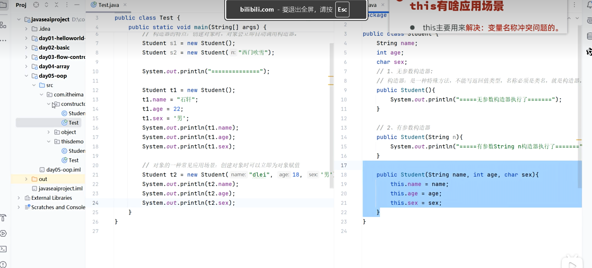
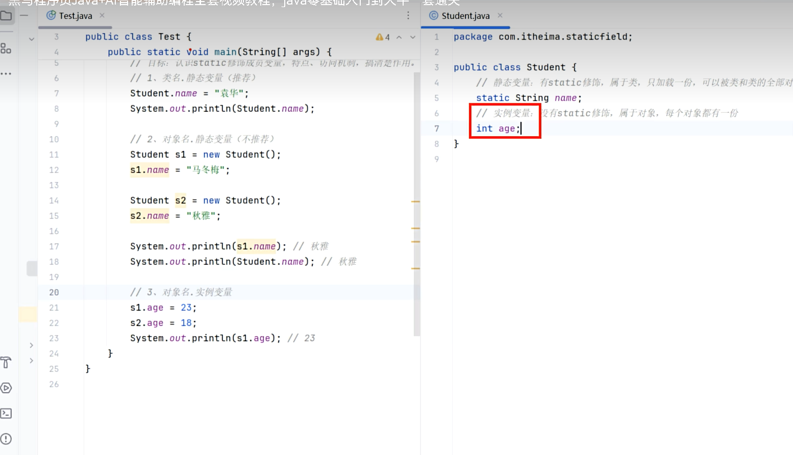

# 构造器


- 当初始化类时候自带默认无参构造器

```java
public class Student {
//此时不初始化构造器自带一个无参构造器
	public class Student ();
	public class Student (char a ，char b){
	name = a ;
	gender = b;
	};

}

public class Main {
	Student s1 = new student();//调用无参构造器
//如果不赋值，此时这里的name属性和gender属性是默认值
	Student s2 = new student("张三"，"男");
	
}
```

# THIS关键字：



- This 关键字用于解决局部变量和成员变量冲突的问题，用this指代当前对象的name属性。
- 注意是当前对象s2的name属性，其是在堆上动态分配的。

# 封装：


- 封装要求做到合理隐藏和合理暴露，调用private关键字修饰，进行隐藏，只有在当前类中可以被访问（防止被错误赋值）
- 调用get和set方法，进行赋值和获取（进行逻辑校验确保合法性），适当的抽象，屏蔽底层的一些细节，类似与黑盒。

# JAVA BEAN(实体类)

- 成员变量私有，提供getter和setter方法（实现分层解耦）
- 提供无参构造器（必须）

# Static:

- static修饰成员变量
- static修饰方法
- 静态方法的应用
- static的注意事项

# static修饰成员变量:



- 静态变量是所有共享的，类似于宏定义
- 成员变量是每个对象（实例）共有的


# static修饰方法：


- Static 修饰方法，属于类持有的，通过类名.方法去访问
- main 方法是静态方法


‍
